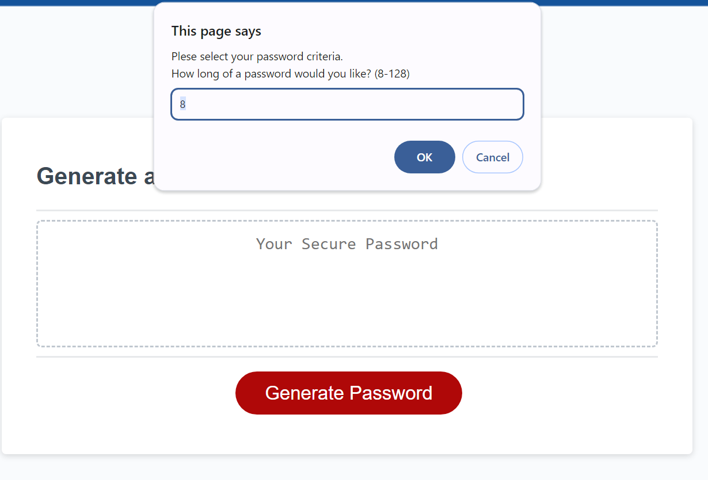
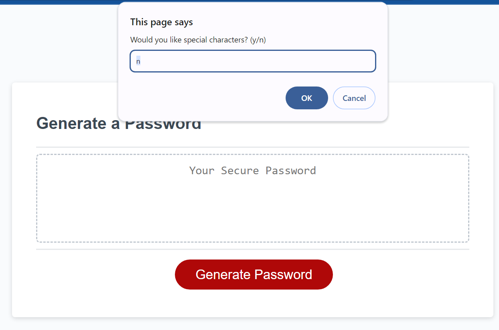
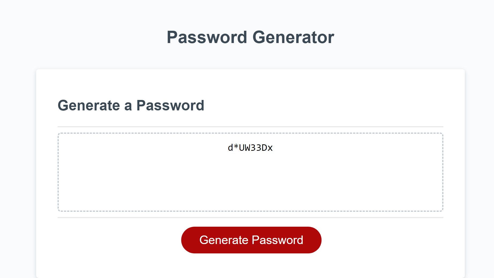

# Password Generator

## Description

This project is a password generator. There are a series of prompts to collect the password criteria. User will decide the length of their password and whether it should include lowercase letters, uppercase letters, numbers, or special characters. Once all prompts are answered, a password is generated and displayed on the main page.

## Installation

N/A

## Usage

Click on the button to Generate Password. Answer each prompt with specified criteria for password. Length of password must be between 8 and 128 characters. Then select y/n for each criteria. Once all prompts are answered, the generated password will be displayed in the main page.

Deployed project:
https://arisof.github.io/passwordGenerator/

 Screenshots:

## Credits

Sofia Villalpando

## License

None
